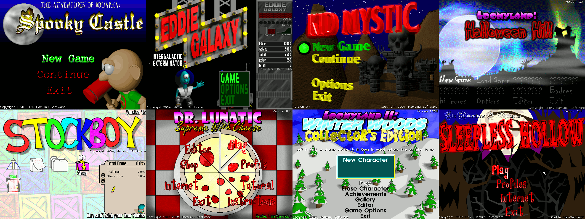

# HamSandwich



**HamSandwich** is a collection of working source code for several of
[Hamumu Software](http://hamumu.com/)'s titles. Running HamSandwich requires
assets from official versions of the games, available for free from
<https://hamumu.itch.io/>.

Saves and profiles from the retail versions of the games are fully compatible
with HamSandwich saves, except that controls will need to be reconfigured.

The original code releases on which this project is based are available on
[hamumu.com](http://hamumu.com/sourcecode/).

See also:

* [Changelog](docs/Changelog.md)
* [List of published mods](https://github.com/SpaceManiac/HamSandwich/wiki)

## Building

The recommended way to compile the games is [MinGW on Windows](#windows-mingw).
You can also build for one of the platforms listed below. Prefer to use Git to
download the source code rather than downloading a ZIP archive as doing so
makes it much easier to stay up-to-date and to publish your mods.

Platform | Toolchain | Testing | Latest build
-|-|-|-
Windows | [MinGW](#windows-mingw) | [Appveyor](https://ci.appveyor.com/project/SpaceManiac/hamsandwich)
Windows | [MSVC](#windows-msvc) | [Appveyor](https://ci.appveyor.com/project/SpaceManiac/hamsandwich) | [📥 Download](https://wombat.platymuus.com/hamsandwich/release/HamSandwich.zip)
[Linux](#linux) | GCC | [Appveyor](https://ci.appveyor.com/project/SpaceManiac/hamsandwich)
[Browser](#emscripten) | Emscripten | [GitHub Actions](https://github.com/SpaceManiac/HamSandwich/actions/workflows/publish-pages.yml) | [🌐 Play in browser](https://spacemaniac.github.io/HamSandwich/)
[Android](#android) | NDK

### Windows (MinGW)

First-time setup:

1. Install MSYS2, an environment for compiling C++ code.
    1. Visit <https://www.msys2.org/> and download and run the latest "msys2-x86_64" installer.
    2. Choose a relatively short path with no spaces (say, `C:\msys64` or `D:\tools\msys2`).
    3. After installation finishes, run `pacman -Syu` in the console that opens.
    4. When asked to do so, close the console and reopen it from the Start Menu (MSYS2 64bit > MSYS2 MinGW 32-bit).
    5. Run `pacman -Syu` again.
2. Use `cd` to select the directory where HamSandwich will go.
    1. For example, if you want the code to go in `C:\projects\HamSandwich`, run `cd C:\projects`.
3. Run `pacman -S git` to install git, a tool used for source code collaboration.
4. Run `git clone https://github.com/SpaceManiac/HamSandwich` to download the code.
5. Run `cd HamSandwich` to enter the directory.

Compiling and running:

1. Run `./run` to see a list of games in the project, and use `./run <project>` to compile and play.
    1. For example, to run Supreme With Cheese, write `./run supreme`.
    2. To compile without running, write `make` or `make <project>`.
    3. The first time you try to run a game, you will be prompted to download
        its installer from <https://hamumu.itch.io/>;
        follow the instructions shown.
2. Run `git pull` to fetch changes which have been published here.

### Windows (MSVC)

1. Double-click `tools/msvc/Generate VS2019 Solution.bat`.
2. Open and compile `build/msc-v142/HamSandwich.sln` in Visual Studio.
    1. For command-line builds, run `msbuild build/msc-v142/HamSandwich.sln /p:Configuration=debug /p:Platform=Win32`.
3. Download installers from <https://hamumu.itch.io/> and save them inside `installers/` without extracting them.
4. Debug from within Visual Studio to launch a game.

Distributing:

1. Double-click `tools/msvc/Create Release Zip.bat`.
2. Upload `build/HamSandwich-windows.zip`.

### Linux

1. Install dependencies (handled automatically on Ubuntu, Arch):
    1. premake-5.0.0-alpha16-linux.tar.gz from <https://github.com/premake/premake-core/releases/tag/v5.0.0-alpha16>.
    2. 32-bit G++ (or Clang) toolchain.
    3. 32-bit SDL2, SDL2_mixer, and SDL2_image development packages.
    4. 7-Zip and Innoextract to extract game assets.
2. Use `make` and `./run` as described above to build and run the games.

### Emscripten

1. If on Windows, install and use MSYS2 according to the instructions above.
2. The [Emscripten SDK] will be installed automatically, or you can do so
   manually:
    1. `cd` to a convenient directory.
    2. `git clone https://github.com/emscripten-core/emsdk.git`
    3. `cd emsdk`
    4. `./emsdk install latest-upstream`
    5. `./emsdk activate latest-upstream`
    6. `source ./emsdk_env.sh`
    7. Return to the HamSandwich directory.
2. Run `./run <project> --web` to run the build and open the result in your
   browser.

Bundling assets (worlds, music, graphics, etc.):

1. Commit your assets to a subfolder in the repository of your choosing.
2. In the appropriate project's section in `premake5.lua`, add a line pointing
   to your assets: `assetdirs "your_asset_folder"`

Publishing on GitHub Pages:

1. Edit `.github/workflows/publish-pages.yml` file and change the
   `distribute-web.sh` line to include only the project or projects you wish to
   publish.
2. Push your changes to GitHub and wait for the build to complete.
3. In your GitHub repository's Settings > Pages tab,
   change the "Source" from "None" to "gh-pages" and click "Save".
4. Your site will be published at `https://yourusername.github.io/HamSandwich`
5. Future pushes will automatically update your site.

Publishing manually:

1. Run `tools/emscripten/distribute-web.sh <project>`.
   1. You can supply multiple projects to build them together.
   2. You can leave off the project identifier to build every project.
2. Upload the contents of `build/webroot/`.

[Emscripten SDK]: https://emscripten.org/docs/getting_started/downloads.html

### Android

1. If on Windows, install and use MSYS2 according to the instructions above.
2. Install Gradle and the Android SDK and set `ANDROID_HOME`.
    1. Example shell command: `export ANDROID_HOME='C:\Wherever you installed the Android SDK\'`
3. Run `./android <project>` to compile APKs.
    1. For example, to build Supreme With Cheese, write `./android supreme`
4. Run `./android --install <project>` to install to a connected Android device.
5. To view logs, run `./android --logcat`

## Modding

To get started with custom worlds, graphics, music, and so on, place your
custom files inside the `appdata/<project>/` folder alongside your profiles.
When the game loads assets it checks that folder before the installer. Any
worlds you save in the editor will show up in this folder.

The simplest way to publish your mod is using the GitHub Pages method described
above. To bundle custom assets with your mod, add an `assetdirs` call to
`premake5.lua` which points to an asset folder of your choosing. You should
move your custom assets out of `appdata/` into this folder and commit them to
Git. For example:

```lua
project "mystic"
    -- ...
    appdata_name "SpaceManiac-mystic-remix"
    assetdirs "assets/mystic-remix"
```

The `appdata_name` directive should be used if your mod's saves/profiles are
not meant to be compatible with the base game's. Most remix worlds fall into
this category. You should include your name at the beginning.


To import another game's content, copy the other game's `installer` block into
that of the game you wish to import them into, for example:
```lua
project "supreme"
    -- ...
    installers {
        ["supreme8_install.exe"] = {
            -- ...
        }
        ["mystic_install.exe"] = {
            -- ...
        }
    }
```

When the game searches for a world or asset file, it scans first the appdata
folder, then the `assetdirs` folders in order, then the `installers` in order.
That means that overrides should go at the beginning of the list and fallbacks
should go at the end.

Check out existing mods on the [list of published mods](https://github.com/SpaceManiac/HamSandwich/wiki).
